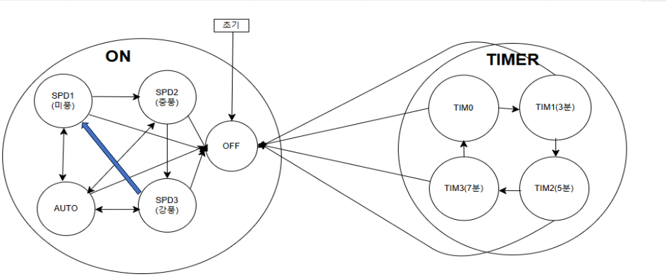

# Smart-Fan :cool:

## 프로젝트 개요 
- 사용자가 버튼 입력을 통해 선풍기의 작동 상태(ON/OFF)와 풍량 세기를 제어할 수 있고, 타이머 기능을 
사용하여 일정 시간 동안 선풍기를 동작시키거나 정지시킬 수 있습니다. LCD, FND을 통해 현재 상태를 표시
## 수행기간 
2024.08.06 ~ 2024.08.09

## 기술 스택
### H/W
- Atmega128a
- Button
- DC Motor
- Motor Driver
- LCD
- FND
- Buzzer
### S/W
- MicroChip Studio
- C언어
---
## FSM

## 주요 기능
- 풍속 제어 (미풍,중풍,강풍)
- 타이머 기능 (3분,5분,7분)
- LCD, FND 상태 표시

## Interrupt 활용
- 외부 인터럽트 ->Button
    - 사용자가 버튼을 누를 때마다 인터럽트 발생
    - 즉각적으로 풍속, 전원, 타이머 상태 변경

- 타이머 인터럽트
    - 설정된 시간(3분,5분,7분)이 경과하면 자동으로 OFF
    - 주기적으로 타이머 인터럽트를 통해 시간 제어

